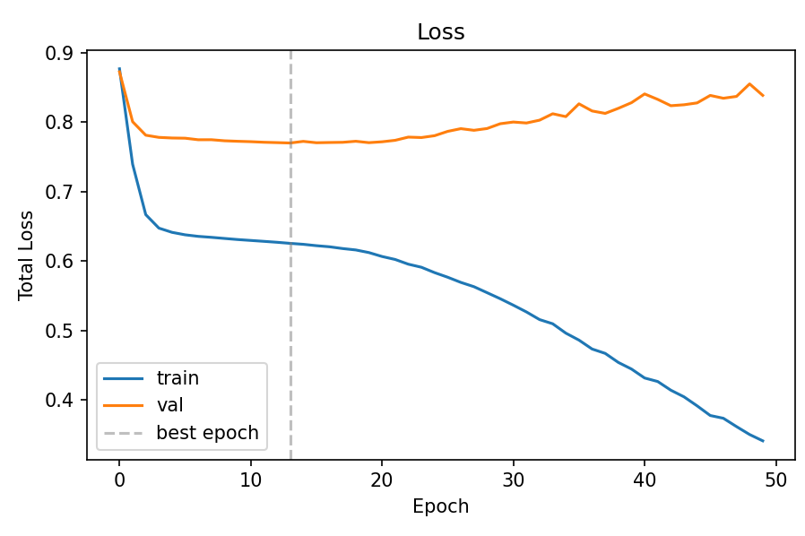
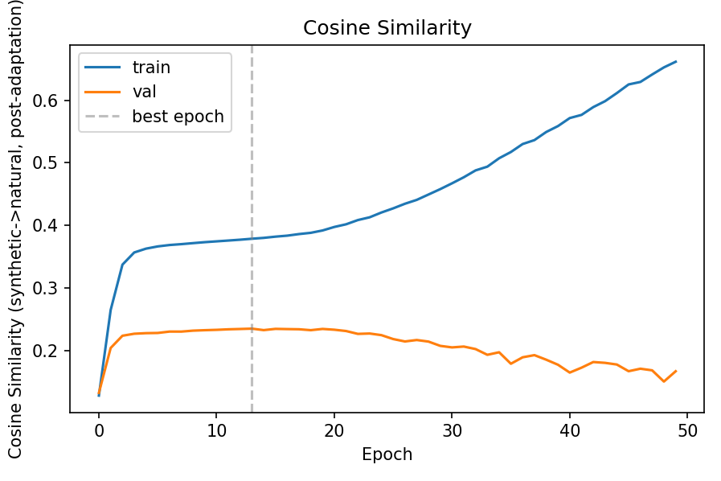
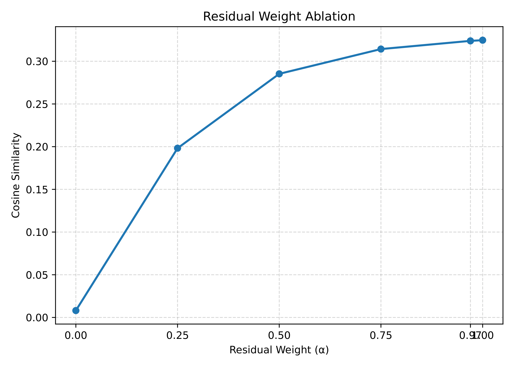
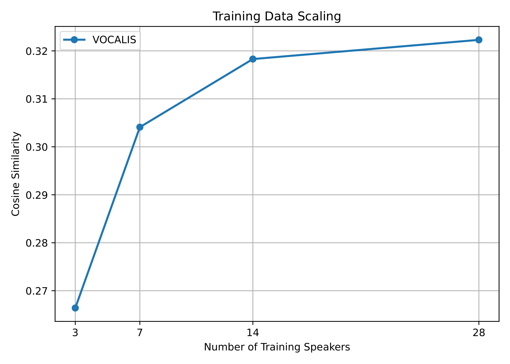

# VOCALIS v3.0: Lightweight Neural Adapter for Synthetic-to-Natural Speaker Embedding Adaptation

## 📖 Overview
Zero-shot speech synthesis is widely used, but speaker embeddings extracted from synthetic speech often do not align well with those from natural recordings. This mismatch occurs because pretrained speaker encoders are tuned heavily on natural speech. 

**VOCALIS** is a lightweight, purely embedding-space residual adapter network designed to bridge this synthetic-to-natural domain gap. It learns to map synthetic speaker embeddings toward their natural counterparts without modifying the pretrained encoder or any downstream systems.

<p align="center">
  
  <br>
  <strong>Fig. 1. Overview of the VOCALIS framework.</strong> Natural and synthetic speech are passed through the same frozen speaker encoder. The synthetic embedding is refined using the proposed residual adapter network before alignment with the corresponding natural speaker embedding during training.
</p>

### Key Highlights
- **Parameter-efficient:** The adapter is small (~462,000 parameters).
- **Fast Training:** Trains typically in 2-3 minutes on ordinary CPU hardware.
- **High Performance:** Increases cosine similarity between synthetic and natural embeddings from 0.0081 (baseline) to 0.3239.
- **Robust Generalization:** Generalizes to unseen TTS systems (e.g., gTTS), improving cosine similarity from 0.0507 to 0.3165 despite never being trained on it.
- **Evaluation:** Outperforms classical linear adaptation methods like Mean-shift and Deep CORAL.

---

## 🛠️ Methodology & Dataset

### Dataset Construction
To train the adapter, we construct a paired dataset of natural and synthetic speech. For each natural VCTK recording, a matching synthetic recording is generated offline using identical transcripts. 

<p align="center">
  
  <br>
  <strong>Fig. 2. Construction of the paired natural–synthetic speech dataset.</strong>
</p>

---

## 📂 Repository Structure
```text
vocalis_3.0/
├── LICENSE             # MIT License file
├── README.md           # This documentation file
├── data/               # Contains the dataset and extracted embeddings
├── images/             # Research paper figures (PDFs and converted PNGs)
├── models/             # Saved model checkpoints and weights
├── notebooks/          
│   ├── original/       # Exploratory and initial notebooks (VOCALIS.ipynb)
│   └── updated/        # Final finalized pipeline (vocalis_v3.ipynb)
├── paper/              # The VOCALIS research paper and supplementary documents
├── piper/              # Piper-TTS standalone Windows binaries for synthetic data generation
├── reference/          # Reference papers (Zero-Shot TTS, WavLM, StyleTTS, etc.)
├── requirements.txt    # Python dependencies for the project
└── results/            
    ├── figures/        # Generated plots and evaluation charts
    └── metrics/        # Evaluation results and metrics
```

---

## ⚙️ Requirements & Installation

**Prerequisites:** Python 3.10+ (Recommended)

1. Clone the repository and navigate to the project root directory.
2. Create and activate a virtual environment (recommended):
   ```bash
   python -m venv venv
   # On Windows
   venv\Scripts\activate
   ```
3. Install the dependencies:
   ```bash
   pip install -r requirements.txt
   ```
   *Note: This project is configured for CPU-only environments.*

**Important Setup Notes:**
- **webrtcvad-wheels**: If using Resemblyzer, make sure `webrtcvad-wheels` is installed before it (this is configured in the requirements).
- **Piper TTS**: The `piper` standalone Windows binary is included in the `piper/` directory. Do not pip-install `piper-tts` due to missing Windows wheels for `piper-phonemize`.

---

## 🚀 Usage

The entire pipeline—from dataset loading to embedding extraction, training, and evaluation—is contained within the Jupyter Notebooks.

1. Launch Jupyter Notebook or open the project in VS Code.
2. Navigate to `notebooks/updated/vocalis_v3.ipynb`.
3. Run the cells sequentially to:
   - Extract ECAPA-TDNN embeddings for both natural (VCTK) and synthetic (Piper) audio.
   - Train the VOCALIS adapter network on the disjoint training split (28 speakers).
   - Evaluate performance (Cosine Similarity, Euclidean Distance, MSE) on the held-out test split (6 speakers).
   - Test cross-synthesis generalization using gTTS.

---

## 📊 Results & Analysis

### Performance Comparison
VOCALIS successfully aligns the synthetic speaker embeddings with the natural embeddings much better than existing linear transformations. The improvement holds up across different random seeds and varying sizes of training data.

| Method | Mean Cosine Similarity |
|--------|------------------------|
| No Adaptation (Baseline) | 0.0081 |
| Deep CORAL | 0.1747 |
| Mean-Shift | 0.2051 |
| **VOCALIS (Proposed)** | **0.3239** |

### Training Dynamics
During the optimization process, training and validation losses are minimized, and cosine similarity between the synthetic and natural embeddings rises steadily.

<p align="center">
  
  
  <br>
  <strong>Fig. 3. Training and validation loss (left) and Fig. 4. Cosine similarity evolution (right) during training.</strong> The dashed lines indicate the selected optimal checkpoint.
</p>

### Sensitivity & Ablation Analysis
We also investigate how the blending parameter $\alpha$ influences the residual connection, and how the volume of training speaker data scales the adapter's capacity.

<p align="center">
  
  
  <br>
  <strong>Fig. 5. Effect of the residual blending weight &alpha; on cosine similarity (left) and Fig. 6. Effect of training set size on adaptation performance (right).</strong>
</p>

---

## 📄 License

This project is licensed under the MIT License - see the [LICENSE](LICENSE) file for details.

---

## 📝 Citation

If you use this work in your research, please refer to the provided paper in the `paper/` directory:

```text
Balaji Ganesh Tammireddy and Puruhutika Rao Tata.
"VOCALIS: A Lightweight Neural Adapter for Synthetic-to-Natural Speaker Embedding Adaptation."
```

## 🤝 Authors
- **Balaji Ganesh Tammireddy** (VIT-AP University)
- **Puruhutika Rao Tata** (VIT-AP University)

